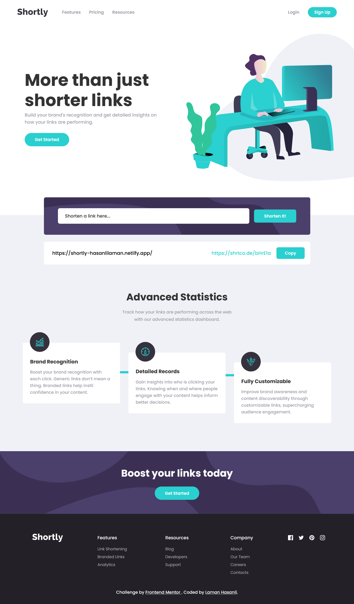

# Frontend Mentor - URL shortening API landing page solution

This is a solution to the [URL shortening API landing page challenge on Frontend Mentor](https://www.frontendmentor.io/challenges/url-shortening-api-landing-page-2ce3ob-G). Frontend Mentor challenges help you improve your coding skills by building realistic projects.

## Table of contents

- [Overview](#overview)
  - [The challenge](#the-challenge)
  - [Screenshot](#screenshot)
  - [Links](#links)
- [My process](#my-process)
  - [Built with](#built-with)
- [Author](#author)

## Overview

### The challenge

Users should be able to:

- View the optimal layout for the site depending on their device's screen size
- See hover states for all interactive elements on the page
- Shorten any valid URL
- See a list of their shortened links, even after refreshing the browser
- Copy the shortened link to their clipboard in a single click
- Receive an error message when the form is submitted if the input field is empty

### Screenshot

### Links

- Solution URL: [https://github.com/HasanliLaman/shortly](https://github.com/HasanliLaman/shortly)
- Live Site URL: [https://shortly-hasanlilaman.netlify.app/](https://shortly-hasanlilaman.netlify.app/)

## My process

### Built with

- Semantic HTML5 markup
- CSS custom properties
- Flexbox
- Mobile-first workflow
- Javascript
- API

## Author

- Github - [Laman Hasanli](https://github.com/HasanliLaman)
- Frontend Mentor - [@HasanliLaman](https://www.frontendmentor.io/profile/HasanliLaman)
